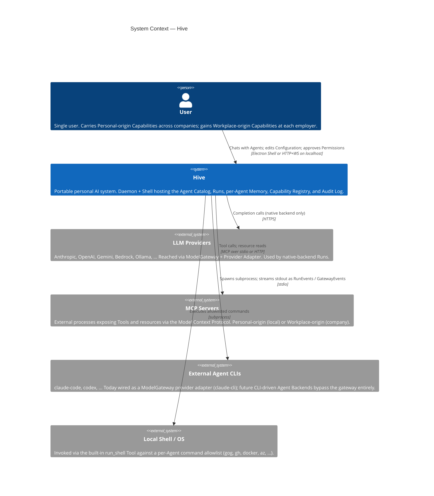

# C1 — System Context

Hive as a single system, the user it serves, and the external systems it depends on. Vocabulary per [CONTEXT.md](../../CONTEXT.md).

## Notes

- **One actor.** Hive is single-user. Multi-Agent dispatch (Root → Worker) is internal, not a context-level relationship.
- **Headless Mode** is the same Daemon binary without the Shell — an operating mode of the same system, not its own context box.
- **External Agent CLIs and LLM Providers are separate** because [ADR-0005](../adr/0005-model-gateway-design.md) splits the gateway and [CONTEXT.md](../../CONTEXT.md#L110) describes the future seam where CLI-driven Agent Backends bypass the gateway entirely.
- **`run_shell` / Local Shell** is shown as external because the per-Agent command allowlist is a real trust boundary.
