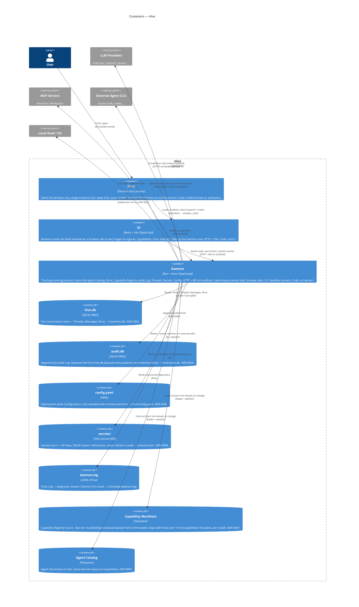

# C2 — Containers

Inside the Hive system boundary: processes (Shell, UI, Daemon) and the on-disk stores under `~/.hive/` and the bundled `bundled/` tree.

## Notes

- **Two SQLite files, on purpose.** `hive.db` is hot conversation state (threads, messages, runs) with mixed reads and updates. `audit.db` is append-only with WAL + future archive rotation. Per the comment at the top of [src/db/hive-db.ts](../../src/db/hive-db.ts), the patterns are different enough that sharing a connection would be wrong.
- **Two-tier storage** (`bundled/` vs `~/.hive/`) applies to both Capabilities and the Agent Catalog. The bundled tree ships with the package and is immutable at runtime; the runtime tree is mutable per install. See [ADR-0007](../adr/0007-capability-lifecycle-and-storage.md).
- **Audit vs Trace.** Two stores, two purposes. Audit answers "what did the user or an agent do?"; Trace answers "why didn't this work?" The Audit Log uses a subscribe pattern (modules emit, Audit consumes); the Trace Log is written at the call site via the [src/lib/log.ts](../../src/lib/log.ts) singleton. See [ADR-0004](../adr/0004-audit-log-design.md).
- **No separate "Memory" container yet.** Per-Agent Memory partitions are deferred — see the Librarian Memory Model in [CONTEXT.md](../../CONTEXT.md#L96). When they land, Memory becomes its own ContainerDb here.
- **UI is one container.** In dev it runs under Vite HMR served by a separate `bun run dev:ui`; in production it's a static bundle the Shell loads. Same React tree either way.
