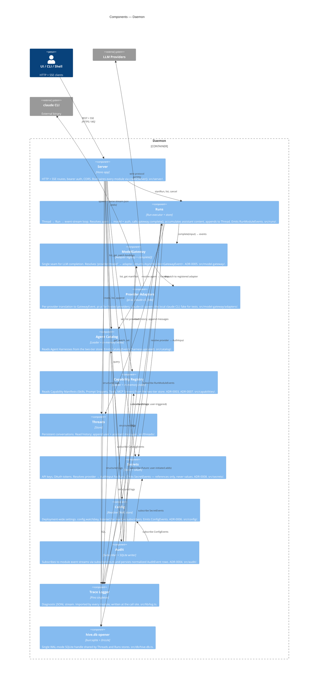

# C3 — Daemon Components

Modules inside the Daemon container. Each one maps to a directory under [src/](../../src/). The wiring lives in [createServer()](../../src/server/index.ts) — read it alongside this diagram.

## Notes

- **Server is the wiring root.** [createServer()](../../src/server/index.ts) constructs every module, injects dependencies, and calls [wireSubscriptions()](../../src/audit/subscriptions.ts) to hook Audit onto the others. The arrows out of Server in the diagram are HTTP routes; the arrows between non-Server components are direct in-process dependencies wired at boot.
- **Audit subscribes; nothing pushes.** Per [ADR-0004](../adr/0004-audit-log-design.md), there is no `audit.record(...)` API. Audit consumes typed event emitters from Runs, Catalog, Secrets, Config (and, in the future, Permission, MCP, Memory). The "subscribe" arrows go *from* Audit *to* the emitter.
- **Two SQLite files, two openers.** Threads + Runs share [hive.db](../../src/db/hive-db.ts). Audit has its own file under [src/audit/db.ts](../../src/audit/db.ts). Connection sharing was rejected on purpose — write patterns differ.
- **The claude CLI is currently a Provider Adapter, not an Agent Backend.** [src/model-gateway/adapters/claude-cli.ts](../../src/model-gateway/adapters/claude-cli.ts) spawns the `claude` binary as a model provider. The future CLI-driven Agent Backend described in [CONTEXT.md](../../CONTEXT.md#L113) would sit alongside Runs and bypass the gateway — when that lands, the diagram grows a second backend lane out of Runs.
- **Trace Logger is a singleton, not a service.** Every module imports `log()` from [src/lib/log.ts](../../src/lib/log.ts) and writes at the call site. The diagram shows a few representative arrows; in reality almost every module writes trace.
- **Missing modules.** Permission, MCP server lifecycle, and per-Agent Memory are documented in CONTEXT.md but not yet implemented under `src/`. They will appear here as they land.
