# C3 — UI Components

React surfaces inside the UI container. Pages, shared components, hooks, and the daemon API client. Code lives under [ui/src/](../../ui/src/).

```mermaid
C4Component
    title Components — UI

    Container_Boundary(ui, "UI") {
        Component(app, "App", "React root", "Top-level tab router (Chat / Agents / Capabilities / Settings). Receives ApiConfig from the Shell preload. ui/src/App.tsx.")

        Component(chat, "ChatPage", "React page", "Thread list + message stream. Uses useChatThread to wire SSE-driven updates. ui/src/pages/ChatPage.tsx.")

        Component(agents, "AgentsPage", "React page", "Agent Catalog browser. Detail view shows Bindings tab for editing Skills/Snippets/Tools/MCP. ui/src/pages/AgentsPage.tsx.")

        Component(caps, "CapabilitiesPage", "React page", "Capability Registry browser. Filters by kind + origin. ui/src/pages/CapabilitiesPage.tsx.")

        Component(settings, "SettingsPage", "React page", "Appearance + Secrets + provider config. ui/src/pages/SettingsPage.tsx.")

        Component(msgcomposer, "MessageComposer", "React component", "Composer + send. Starts a Run via api.startRun. ui/src/components/MessageComposer.tsx.")

        Component(msglist, "MessageList", "React component", "Renders Thread messages + streaming assistant deltas. ui/src/components/MessageList.tsx.")

        Component(agentdetail, "AgentDetail", "React component", "Agent Harness view. Hosts BindingsTab. ui/src/components/AgentDetail.tsx.")

        Component(bindings, "BindingsTab", "React component", "Edit Capability bindings on an Agent Harness. Calls PATCH /agents/:id/bindings. ui/src/components/BindingsTab.tsx.")

        Component(capfilter, "CapabilityFilterBar", "React component", "Kind + origin filters; backed by ui/src/capability-filters.ts.")

        Component(secretsui, "SecretsSettings", "React component", "API key + OAuth provider management. ui/src/components/SecretsSettings.tsx.")

        Component(appearui, "AppearanceSettings", "React component", "Theme mode + palette + typography. Persists via theming-hive-persistence.ts.")

        Component(chrome, "ChromeBridge", "React component", "Wires Electron window controls + deep links into React state.")

        Component(usechat, "useChatThread", "Hook", "Per-Thread state: messages, in-flight Run, retry. ui/src/hooks/useChatThread.ts.")

        Component(useedit, "useAgentEditor", "Hook", "Per-Agent edit session: pending bindings, dirty flag, save. ui/src/hooks/useAgentEditor.ts.")

        Component(useappear, "useAppearanceSettings", "Hook", "Reactive read/write over Configuration's appearance subtree. ui/src/components/useAppearanceSettings.ts.")

        Component(api, "api client", "TypeScript module", "Typed fetch wrappers over the Daemon REST. Reads {baseUrl, token} from window.__hive or URL params. ui/src/api.ts.")

        Component(events, "events client", "TypeScript module", "EventSource subscriber. Invalidates TanStack Query caches on catalog/registry events. ui/src/events.ts.")

        Component(theming, "Theming", "Module", "ThemeProvider + preset resolution + token CSS. ui/src/theming/.")

        Component(editsession, "editing-session", "Module", "Dirty-state tracking for multi-field edits. ui/src/editing-session.ts.")

        Component(capfilters, "capability-filters", "Module", "Pure filter predicates over Capability summaries. ui/src/capability-filters.ts.")
    }

    Person(user, "User")
    Container(daemon, "Daemon", "Bun + Hono", "Localhost HTTP + SSE")

    Rel(user, app, "Clicks; types")

    Rel(app, chat, "renders")
    Rel(app, agents, "renders")
    Rel(app, caps, "renders")
    Rel(app, settings, "renders")

    Rel(chat, msglist, "uses")
    Rel(chat, msgcomposer, "uses")
    Rel(chat, usechat, "uses")

    Rel(agents, agentdetail, "uses")
    Rel(agentdetail, bindings, "uses")
    Rel(agents, useedit, "uses")
    Rel(bindings, capfilter, "uses")

    Rel(caps, capfilter, "uses")
    Rel(caps, capfilters, "uses")

    Rel(settings, secretsui, "uses")
    Rel(settings, appearui, "uses")
    Rel(appearui, useappear, "uses")

    Rel(app, chrome, "mounts")
    Rel(app, theming, "wraps in ThemeProvider")
    Rel(useedit, editsession, "uses")

    Rel(usechat, api, "calls")
    Rel(usechat, events, "subscribes")
    Rel(useedit, api, "calls")
    Rel(useappear, api, "calls")
    Rel(secretsui, api, "calls")
    Rel(bindings, api, "calls")

    Rel(api, daemon, "REST", "HTTPS")
    Rel(events, daemon, "SSE /api/events", "HTTPS")
```

## Notes

- **Two transports, one daemon.** REST for reads + commands ([api.ts](../../ui/src/api.ts)); SSE for cache invalidation ([events.ts](../../ui/src/events.ts)). The events client doesn't carry payloads — it just tells TanStack Query which keys are stale, and Query re-fetches over REST.
- **Auth lives in the preload.** The Shell's [preload.ts](../../shell/src/preload.ts) injects `window.__hive = { baseUrl, token }`. In dev/browser, the same shape comes from URL query params. The api client is the only module that reads this — everything else gets `ApiConfig` passed in.
- **No global store.** State is local-per-page with TanStack Query for server cache. Hooks (`useChatThread`, `useAgentEditor`, `useAppearanceSettings`) own the per-page workflows; modules (`editing-session`, `capability-filters`) are pure logic.
- **Theming is reactive over Configuration.** [useAppearanceSettings](../../ui/src/components/useAppearanceSettings.ts) reads + writes the Configuration's `appearance` subtree through the api client; the ThemeProvider consumes that and emits CSS variables. Daemon-side, the Audit Log redacts appearance payloads to just the mode picker per the privacy comment in [src/audit/subscriptions.ts](../../src/audit/subscriptions.ts).
- **Tests omitted.** Every `__tests__/` directory is a sibling of the module it tests; representing them on the diagram would double the node count without adding signal.
